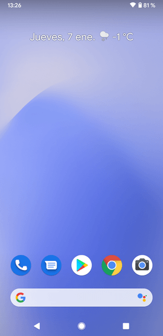
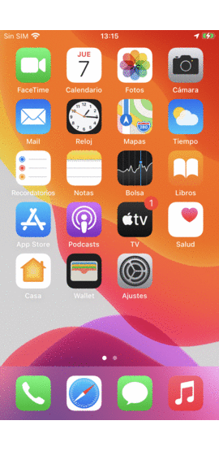

# Rick & Morty KMM

* Kotlin Multiplatform Mobile [KMM]
* [Compose] Coming soon / [SwiftUI]
* [MVI]
* [Flow]
* [Sqldelight]
* [Ktor]
* [Koin]

## Architecture

## Result

## Especial thank

* [Alex Fuhrmann] for his fantastic job: [The Rick and Morty Api]

[KMM]: https://kotlinlang.org/lp/mobile/
[Flow]: https://github.com/Kotlin/kotlinx.coroutines
[Sqldelight]: https://cashapp.github.io/sqldelight/
[Ktor]: https://ktor.io/
[The Rick and Morty Api]: https://rickandmortyapi.com/
[Alex Fuhrmann]: https://axelfuhrmann.com/
[Koin]: https://insert-koin.io/docs/setup/v3
[Compose]: https://developer.android.com/jetpack/compose
[SwiftUI]: https://developer.apple.com/xcode/swiftui/
[MVI]: https://abhiappmobiledeveloper.medium.com/android-mvi-reactive-architecture-pattern-74e5f1300a87