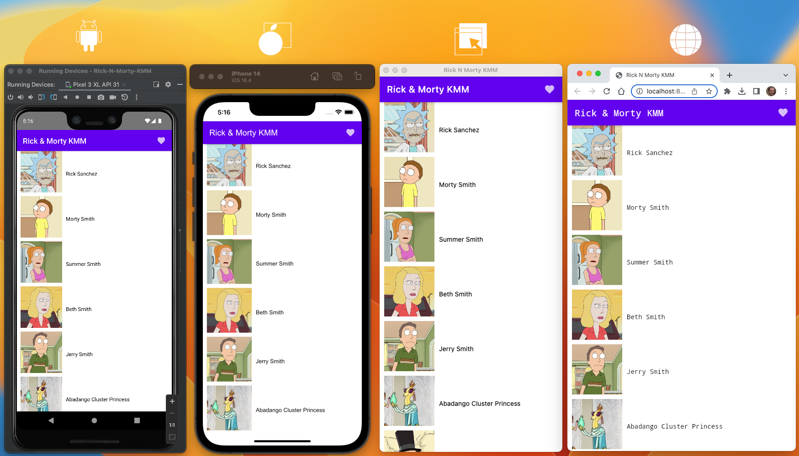
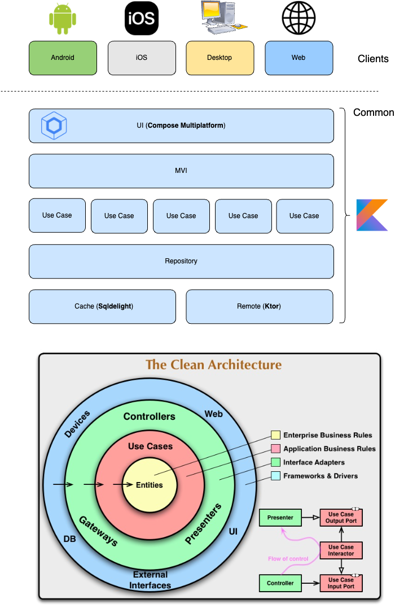

# Rick & Morty KMM

* Kotlin/Compose Multiplatform Mobile [KMM]
* [Compose]
* [Voyager]
* [Compose Multiplatform Wizard]
* [MVI]
* [Flow]
* [Sqldelight]
* [Ktor]
* [Koin]

## Android, iOS, Desktop, Web

## Architecture

    
  

## Run project

### Android
To run the application on android device/emulator:
- open project in Android Studio and run imported android run configuration

To build the application bundle:
- run `./gradlew :composeApp:assembleDebug`
- find `.apk` file in `composeApp/build/outputs/apk/debug/composeApp-debug.apk`

### Desktop
Run the desktop application: `./gradlew :composeApp:run`

### iOS
To run the application on iPhone device/simulator:
- Open `iosApp/iosApp.xcworkspace` in Xcode and run standard configuration
- Or use [Kotlin Multiplatform Mobile plugin](https://plugins.jetbrains.com/plugin/14936-kotlin-multiplatform-mobile) for Android Studio

### Browser
Run the browser application: `./gradlew :composeApp:jsBrowserDevelopmentRun`

## Especial thanks

* [Alex Fuhrmann] for his fantastic job: [The Rick and Morty Api]
* [Compose Multiplatform Wizard] amazing tool to create KMM template
* [Voyager] simply: makes your kmm life easy

[KMM]: https://kotlinlang.org/lp/mobile/
[Flow]: https://github.com/Kotlin/kotlinx.coroutines
[Sqldelight]: https://cashapp.github.io/sqldelight/
[Ktor]: https://ktor.io/
[The Rick and Morty Api]: https://rickandmortyapi.com/
[Alex Fuhrmann]: https://axelfuhrmann.com/
[Koin]: https://insert-koin.io/docs/setup/v3
[Compose]: https://www.jetbrains.com/lp/compose-multiplatform/
[MVI]: https://abhiappm
[Voyager]: https://voyager.adriel.cafe/
[Compose Multiplatform Wizard]: https://terrakok.github.io/Compose-Multiplatform-Wizard/

